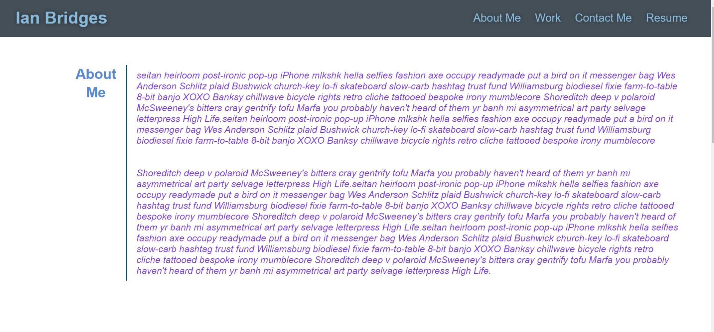
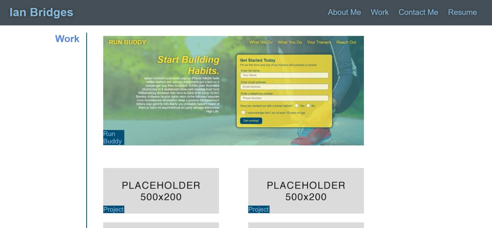
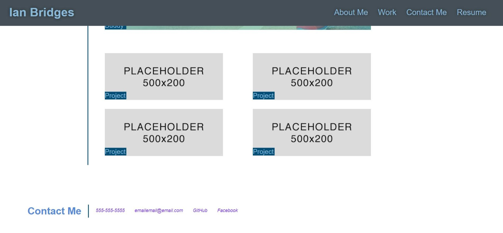

# Building Custom Portfolio, Module-2-Challenge

    In this assignment I created a custom, personal portfolio.
    I displayed some of my coding abilities and also showed 
    previos work. There is a link to my resume and contact
    information so anyone interested in can reach out.

[Website](https://ianbridges.github.io/Module-2-Challenge/)

